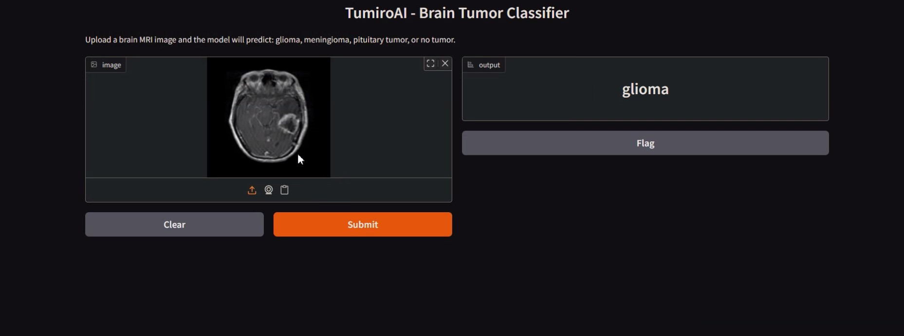

# Brain Tumor MRI Classification

## About the Project

This project aims to automate the classification of brain tumors from MRI images using deep learning techniques. Early and accurate detection of brain tumors is critical for effective treatment and improved patient outcomes. By leveraging Convolutional Neural Networks (CNNs), this project provides a robust solution for distinguishing between different types of brain tumors and healthy brain scans. The solution is designed to assist clinicians and researchers by providing fast, reliable, and reproducible results, reducing the burden of manual image analysis and supporting clinical decision-making.

The project encompasses the entire machine learning pipeline, including data preprocessing, model development, training, evaluation, and deployment. The codebase is organized for clarity and reproducibility, making it easy for other researchers and practitioners to adapt or extend the work for related medical imaging tasks.

## About the Dataset

The dataset used in this project is sourced from Kaggle: [Brain Tumor MRI Dataset](https://www.kaggle.com/datasets/masoudnickparvar/brain-tumor-mri-dataset/data).

- **Total Images:** 7,023 MRI scans
- **Classes:** Glioma Tumor, Meningioma Tumor, Pituitary Tumor, No Tumor
- **Data Sources:** The dataset is a combination of multiple sources, including Figshare, SARTAJ, and Br35H datasets, ensuring diversity in imaging conditions and patient demographics.
- **Image Characteristics:** Images vary in size, resolution, and margin. Some classes, such as Glioma, required relabeling due to inconsistencies in the original datasets.
- **Data Structure:** The dataset is organized into separate folders for training and testing, with subfolders for each class.

This dataset presents real-world challenges such as class imbalance, varying image quality, and potential mislabeling, making it suitable for developing robust and generalizable models.

## Notebook Summary

The provided Jupyter notebook walks through the complete workflow for brain tumor classification:

1. **Problem Definition:** Outlines the clinical motivation and the importance of automated tumor detection.
2. **Data Preparation:** Details the loading, augmentation, and normalization of MRI images to ensure consistency and improve model generalization.
3. **Model Building:** Implements a custom CNN architecture tailored for multi-class classification of MRI images.
4. **Training:** Trains the model using the prepared dataset, tracks performance metrics, and saves the best-performing model.
5. **Evaluation:** Evaluates the trained model using accuracy, precision, recall, F1-score, and confusion matrix. Visualizes both the training process and the results.
6. **Results and Discussion:** Summarizes findings and suggests potential improvements, such as increasing training epochs or experimenting with different architectures.

The notebook is modular, with clear separation between data handling, model logic, and evaluation, making it easy to follow and modify.

## Model Results

### Preprocessing

- **Resizing:** All images are resized to 224x224 pixels to standardize input dimensions for the CNN.
- **Augmentation:** Random horizontal flips and rotations (up to 10 degrees) are applied to increase data diversity and reduce overfitting.
- **Normalization:** Images are normalized using ImageNet mean and standard deviation values to facilitate transfer learning and stable training.

### Training

- **Architecture:** The model is a custom CNN with two convolutional layers followed by fully connected layers. It is designed to balance complexity and computational efficiency.
- **Loss Function:** Cross-entropy loss is used for multi-class classification.
- **Optimizer:** Adam optimizer is employed for efficient gradient-based optimization.
- **Training Regimen:** The model is trained for 15 epochs (with suggestions to increase to 20-25 for improved results), using separate loaders for training and validation data.
- **Checkpointing:** The best model (based on validation accuracy) is saved for later evaluation.

### Evaluation

- **Metrics:** The model is evaluated using accuracy, precision, recall, and F1-score (macro-averaged for multi-class).
- **Confusion Matrix:** A confusion matrix is plotted to visualize class-wise performance and identify potential misclassifications.
- **Training History:** Loss and accuracy curves are plotted for both training and validation sets to monitor learning dynamics and detect overfitting or underfitting.

The model achieves a macro F1-score of approximately 0.97, demonstrating strong performance across all classes. Further improvements can be made by tuning hyperparameters, increasing training epochs, or experimenting with deeper architectures.

## How to Install

Follow these steps to set up the environment using Python's built-in `venv` module:

```bash
# Clone the repository
git clone https://github.com/DeepActionPotential/TumrioAI
cd TumrioAI


# Create a virtual environment
python -m venv venv

# Activate the virtual environment
# On Windows:
venv\Scripts\activate
# On macOS/Linux:
source venv/bin/activate


# Install required dependencies
pip install -r requirements.txt
```


## How to Use the Software


1. **Demo:**
## [demo-video](assets/brain_tumor_demo.mp4)
 


## Technologies Used


- **PyTorch:** Used for building, training, and evaluating the deep learning model. PyTorch provides flexibility and ease of use for custom model development.
- **Torchvision:** Supplies datasets, model architectures, and image transformation utilities, streamlining the data preprocessing and augmentation process.
- **NumPy:** Facilitates efficient numerical computations and array manipulations.
- **Matplotlib & Seaborn:** Used for data visualization, including plotting images, training curves, and confusion matrices.
- **scikit-learn:** Provides metrics for model evaluation, such as precision, recall, and F1-score.
- **Jupyter Notebook / VS Code:** Interactive development environments for running and documenting experiments.

These technologies were chosen for their robustness, community support, and suitability for rapid prototyping and research in deep learning and computer vision.

## License

This project is licensed under the MIT License. You are free to use, modify, and distribute this software for personal, academic, or commercial purposes, provided that you include the original copyright and license notice.

See the [LICENSE](LICENSE) file for more details.
